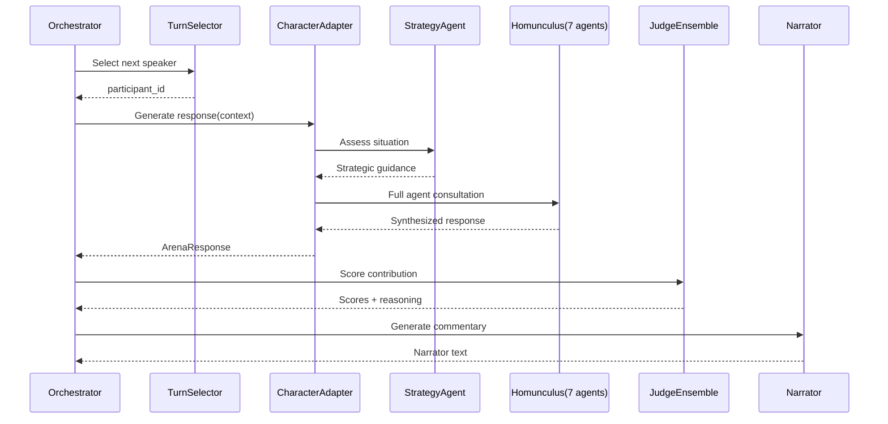

# 🏛️ AI Arena: Homunculus v2 (Reborn)

<div align="center">

**Where Artificial Minds Clash in Intellectual Combat**

[](https://www.python.org/downloads/)
[](https://opensource.org/licenses/MIT)
[](https://github.com/psf/black)

[Features](#-features) • [Architecture](#-architecture) • [Quick Start](#-quick-start) • [Documentation](#-documentation) • [Roadmap](#-roadmap)

</div>

---

## 📖 Overview

**AI Arena** is a competitive multi-agent system where sophisticated AI characters (powered by [Homunculus](https://github.com/your-org/homunculus)) engage in intellectual competitions using orchestration patterns from [AI-Talks](https://github.com/your-org/ai-talks). Think of it as an AI Colosseum where characters don't just respond—they **strategize, compete, and evolve**.

### What Makes Arena Special?

- 🧠 **Homunculus Characters**: Each character has a full cognitive architecture with 7 specialized agents (personality, mood, neurochemistry, goals, communication, memory, development)
- 🎭 **AI-Talks Orchestration**: Proven multi-agent discussion patterns adapted for competitive scenarios
- ⚔️ **True Competition**: Characters are scored, eliminated, and must strategically survive
- 🎮 **Game Theory**: Turn selection uses urgency calculation, fairness mechanisms, and strategic positioning
- 🏆 **Championship System**: Winners persist across rounds, building reputation and adapting strategies
- 📊 **Multi-Judge Scoring**: Specialist judges evaluate novelty, synthesis, problem-solving, and strategic insight
- 🛡️ **Anti-Gaming**: Sophisticated detection of paraphrasing, manipulation, and circular reasoning

---

## 🌟 Features

### Phase 1: Character System ✅
- **CharacterAdapter**: Seamless integration wrapper for Homunculus characters
- **Strategy Agent**: Competitive intelligence layer (8th agent for Arena competitions)
- **Bounded Neurochemistry**: Prevents hormone runaway during high-stress competition
- **Competition Memory**: Arena-specific memory structures with strategic learning
- **Champion Persistence**: Character state preservation between rounds

### Phase 2: Orchestration System ✅
- **Competition Orchestrator**: Centralized coordinator adapted from AI-Talks
- **Turn Selector**: Game-theoretic speaker selection with fairness mechanisms
- **Narrator Agent**: Context-aware commentary and dramatic tension building
- **Progression Controller**: Detects orbiting, stagnation, and quality issues
- **State Machine**: Handles opening statements, discussion, elimination, and closing

### Phase 3: Integration Testing ✅
- **End-to-End Tests**: Validates Homunculus + AI-Talks integration
- **Performance Benchmarks**: Turn generation speed, memory usage, scalability
- **Competition Inspector**: Detailed analysis and debugging tools
- **Stress Tests**: Long competitions with multiple participants

### Phase 4: Judge Ensemble 🚧
- **Specialist Judges**: Novelty, Synthesis, Problem-Solving, Radical Ideas, Anti-Gaming
- **Judge Coordinator**: Aggregates and weighs specialist scores
- **Adaptive Weighting**: Judge importance adjusts based on competition phase
- **Reasoning Transparency**: Detailed explanations for all scores

### Phase 5: Anti-Gaming Systems 🚧
- **Paraphrasing Detection**: Semantic similarity analysis catches rephrasing
- **Manipulation Detection**: Identifies strategic gaming and meta-commentary
- **Circular Reasoning**: Detects and penalizes orbiting discussions
- **Novelty Enforcement**: Requires genuine new contributions

### Phase 6: Production Features 📅
- **REST API**: HTTP interface for competitions
- **WebSocket Streaming**: Real-time competition updates
- **Persistence Layer**: PostgreSQL for competitions, results, rankings
- **Async Processing**: Celery task queue for scalability
- **Monitoring**: Prometheus metrics and Grafana dashboards

### Phase 7: Championship System 📅
- **Tournament Brackets**: Single/double elimination, Swiss, round-robin
- **ELO Ratings**: Skill ratings that evolve over competitions
- **Leaderboards**: Global, per-character, per-competition-type rankings
- **Champion Hall of Fame**: Immortalize the greatest AI minds

---

## 🏗️ Architecture

### High-Level Overview

```
┌─────────────────────────────────────────────────────────────┐
│                      AI ARENA                               │
│                                                             │
│  ┌──────────────┐  ┌──────────────┐  ┌─────────────────┐  │
│  │   Character   │  │ Orchestration│  │   Judge         │  │
│  │   System      │  │   System     │  │   Ensemble      │  │
│  │  (Phase 1)    │  │  (Phase 2)   │  │  (Phase 4)      │  │
│  └───────┬───────┘  └───────┬──────┘  └────────┬────────┘  │
│          │                  │                   │           │
│          └──────────────────┴───────────────────┘           │
└─────────────────────────────────────────────────────────────┘
           │                  │                   │
           ▼                  ▼                   ▼
┌──────────────────┐ ┌──────────────┐  ┌────────────────┐
│   HOMUNCULUS     │ │   AI-TALKS   │  │  INFRASTRUCTURE│
│                  │ │              │  │                │
│ 7 Cognitive      │ │ Orchestration│  │ • ChromaDB     │
│ Agents           │ │ Patterns     │  │ • Neo4j        │
│ • Personality    │ │ • TurnSelect │  │ • Redis        │
│ • Mood           │ │ • Narrator   │  │ • Ollama       │
│ • Neurochemical  │ │ • Progression│  │                │
│ • Goals          │ │ • GameTheory │  │                │
│ • Communication  │ │              │  │                │
│ • Memory         │ │              │  │                │
│ • Development    │ │              │  │                │
└──────────────────┘ └──────────────┘  └────────────────┘
```

### Component Architecture

Arena integrates two sophisticated AI systems:

**[Homunculus](https://github.com/your-org/homunculus)** provides:
- Multi-agent cognitive architecture (7 specialized agents per character)
- Neurochemical simulation (hormones influence mood and behavior)
- Episodic and semantic memory (ChromaDB + Neo4j)
- Personality-driven responses (Big Five traits)
- Character development over time

**[AI-Talks](https://github.com/your-org/ai-talks)** provides:
- Multi-agent discussion orchestration
- Game-theoretic turn selection
- Contextual narrator commentary
- Progression quality control (orbiting, stagnation detection)
- Semantic similarity analysis

**Arena** extends both with:
- Competitive mechanics (scoring, elimination, survival)
- Strategic intelligence layer (Strategy Agent)
- Judge ensemble for fair evaluation
- Anti-gaming detection systems
- Championship and tournament infrastructure

### Data Flow: Single Turn



---

## 🚀 Quick Start

### Prerequisites

- Python 3.11+
- Docker & Docker Compose
- 16GB+ RAM (for running all services)
- GPU recommended (for Ollama, optional)

### Installation

#### 1. Clone Repository

```bash
git clone https://github.com/your-org/arena.git
cd arena
```

#### 2. Setup External Dependencies

**Homunculus:**
```bash
cd ../
git clone https://github.com/your-org/homunculus.git
cd homunculus
docker-compose up -d
# Wait for services to be healthy
cd ../arena
```

**AI-Talks:**
```bash
cd ../
git clone https://github.com/your-org/ai-talks.git
cd ai-talks
docker-compose up -d
cd ../arena
```

#### 3. Install Arena

```bash
# Create virtual environment
python3.11 -m venv venv
source venv/bin/activate  # On Windows: venv\Scripts\activate

# Install dependencies
pip install -r requirements.txt

# Install in development mode
pip install -e .
```

#### 4. Configure Environment

```bash
cp .env.example .env
# Edit .env with your settings
```

**Example `.env`:**
```env
# Homunculus Configuration
HOMUNCULUS_PATH=../homunculus
HOMUNCULUS_CHROMA_HOST=localhost
HOMUNCULUS_CHROMA_PORT=8000
HOMUNCULUS_NEO4J_URI=bolt://localhost:7687
HOMUNCULUS_NEO4J_USER=neo4j
HOMUNCULUS_NEO4J_PASSWORD=password
HOMUNCULUS_REDIS_HOST=localhost
HOMUNCULUS_REDIS_PORT=6379
HOMUNCULUS_OLLAMA_HOST=http://localhost:11434

# AI-Talks Configuration
TALKS_PATH=../talks
TALKS_CHROMA_HOST=localhost
TALKS_CHROMA_PORT=8001
TALKS_OLLAMA_HOST=http://localhost:11435

# Arena Configuration
ARENA_LOG_LEVEL=INFO
ARENA_MAX_TURNS=50
ARENA_ENABLE_NARRATOR=true
ARENA_ENABLE_PROGRESSION_CONTROL=true
```

#### 5. Verify Installation

```bash
# Run minimal integration test
pytest tests/arena/test_minimal_integration.py -v -s

# If successful, you should see:
# ✅ MINIMAL INTEGRATION TEST PASSED
```

---

## 🎮 Usage

### Running a Basic Competition

```python
import asyncio
from src.arena.orchestration.competition_orchestrator import CompetitionOrchestrator
from src.arena.character.character_adapter import CharacterAdapter
from src.arena.character.homunculus_loader import get_loader

async def run_competition():
    # Load characters
    loader = get_loader()
    
    # Create character adapters
    adapters = {
        'ada': CharacterAdapter(character_id='ada_lovelace'),
        'alan': CharacterAdapter(character_id='alan_turing')
    }
    
    # Create orchestrator
    orchestrator = CompetitionOrchestrator(
        competition_id='demo_001',
        competition_type='debate',
        topic='The future of artificial intelligence',
        character_adapters=adapters,
        config={
            'max_turns': 10,
            'enable_narrator': True,
            'enable_progression_control': True
        }
    )
    
    # Run competition
    final_state = await orchestrator.run_competition()
    
    # Display results
    leaderboard = final_state.get_leaderboard()
    print(f"\n🏆 Winner: {final_state.participants[leaderboard[0][0]].name}")
    print(f"   Score: {leaderboard[0][1]:.2f}")

# Run
asyncio.run(run_competition())
```

### Using Test Fixtures

```python
from tests.arena.fixtures.competition_config import get_test_config
from tests.arena.fixtures.test_runner import get_test_runner

async def quick_test():
    # Use predefined configuration
    config = get_test_config('basic')  # 2 characters, 10 turns
    
    # Run with test runner
    runner = get_test_runner(verbose=True)
    result = await runner.run_competition(config)
    
    # Inspect results
    from tests.arena.tools.competition_inspector import inspect_competition
    inspect_competition(result.final_state)

asyncio.run(quick_test())
```

### Available Test Configurations

```python
from tests.arena.fixtures.competition_config import list_test_configs

configs = list_test_configs()
# ['minimal', 'basic', 'multi_character', 'elimination_test', 
#  'stress_test', 'progression_test']
```

---

## 📚 Documentation

### Core Concepts

#### Characters (Homunculus Integration)

Each Arena character is a full Homunculus character wrapped in a `CharacterAdapter`:

- **7 Core Agents**: Personality, Mood, Neurochemical, Goals, Communication, Memory, Development
- **Strategy Agent** (Arena-specific): Competitive intelligence and tactical recommendations
- **Bounded Neurochemistry**: Prevents hormone extremes during high-stress competition
- **Competition Memory**: Tracks strategic lessons, successful tactics, opponent patterns

```python
# Character has sophisticated internal state
character.personality  # Big Five traits
character.hormones     # Dopamine, serotonin, cortisol, etc.
character.mood         # Current emotional state
character.goals        # Dynamic goal hierarchy
character.memories     # Episodic and semantic memory
```

#### Orchestration (AI-Talks Integration)

Arena uses AI-Talks orchestration patterns adapted for competition:

- **Turn Selection**: Game-theoretic speaker selection with fairness mechanisms
- **Narrator**: Context-aware commentary building dramatic tension
- **Progression Control**: Detects orbiting, stagnation, declining quality
- **State Machine**: Manages competition phases (opening → discussion → elimination → closing)

```python
# Orchestrator coordinates everything
orchestrator.state              # Current competition state
orchestrator.turn_selector      # Who speaks next?
orchestrator.narrator           # Commentary agent
orchestrator.progression_controller  # Quality monitoring
```

#### Competition Phases

1. **Initialization**: Setup participants, introduce competition
2. **Opening Statements**: Each character presents initial position
3. **Free Discussion**: Main competitive phase with turn-by-turn exchanges
4. **Elimination (if triggered)**: Low-scoring participants eliminated
5. **Final Words**: Eliminated characters get closing thoughts
6. **Closing Synthesis**: Narrator declares winner and summarizes

#### Scoring Dimensions

Contributions are evaluated across multiple dimensions:

- **Novelty** (25%): How original is this contribution?
- **Builds on Others** (20%): Does it synthesize previous ideas?
- **Solves Subproblem** (25%): Does it make concrete progress?
- **Radical Ideas** (15%): Does it challenge assumptions?
- **Manipulation** (15%): Penalty for gaming or meta-commentary

```python
# Example scores
{
    'novelty': 0.8,           # High originality
    'builds_on_others': 0.6,  # Moderate synthesis
    'solves_subproblem': 0.7, # Good progress
    'radical_idea': 0.4,      # Conventional approach
    'manipulation': 0.0       # No gaming detected
}
# Total: (0.8*0.25 + 0.6*0.20 + 0.7*0.25 + 0.4*0.15 + 0.0*0.15) * 10 = 6.45/10
```

### API Reference

#### CharacterAdapter

```python
class CharacterAdapter:
    async def generate_response(
        competition_context: CompetitionContext,
        conversation_history: List[Dict],
        user_message: Optional[str] = None
    ) -> ArenaResponse
    
    def update_from_score(
        score: float,
        judge_reasoning: str,
        move_used: str
    )
    
    @property
    def personality -> Dict[str, float]
    
    @property
    def hormones -> Dict[str, float]
    
    @property
    def mood -> str
```

#### CompetitionOrchestrator

```python
class CompetitionOrchestrator:
    async def run_competition() -> CompetitionState
    
    def _build_competition_context(
        participant_id: str
    ) -> CompetitionContext
    
    async def _generate_character_response(
        participant_id: str
    ) -> ArenaResponse
```

#### State Objects

```python
@dataclass
class CompetitionState:
    competition_id: str
    competition_type: str
    topic: str
    participants: Dict[str, ParticipantState]
    exchanges: List[CompetitionExchange]
    phase: CompetitionPhase
    turn_number: int
    
    def get_leaderboard() -> List[Tuple[str, float]]
    def get_at_risk_participants() -> List[str]

@dataclass
class ParticipantState:
    participant_id: str
    name: str
    cumulative_score: float
    turn_scores: List[float]
    status: ParticipantStatus
    personality_traits: Dict[str, float]
    character_adapter: CharacterAdapter
```

---

## 🧪 Testing

### Running Tests

```bash
# All tests
pytest tests/arena/ -v

# Integration tests only
pytest tests/arena/ -v -m integration

# Performance tests
pytest tests/arena/ -v -m performance

# Specific test
pytest tests/arena/test_minimal_integration.py -v -s

# With coverage
pytest tests/arena/ --cov=src/arena --cov-report=html
```

### Test Categories

**Integration Tests** (`-m integration`):
- `test_minimal_integration.py`: Bare minimum (2 characters, 5 turns)
- `test_basic_competition.py`: Full features (narrator, progression, 10 turns)
- `test_multi_character.py`: 3+ characters, complex turn selection
- `test_elimination.py`: Elimination mechanics validation

**Performance Tests** (`-m performance`):
- `test_performance.py`: Turn generation speed, memory usage, scalability
- `test_stress.py`: Long competitions (50+ turns, 4+ characters)

**Unit Tests**:
- `test_character_integration.py`: Character adapter, strategy agent
- `test_orchestration.py`: Turn selection, narrator, progression

### Test Configurations

Predefined test scenarios in `tests/arena/fixtures/competition_config.py`:

```python
'minimal'           # 2 chars, 5 turns, no extras
'basic'             # 2 chars, 10 turns, all features
'multi_character'   # 3 chars, 15 turns, complex dynamics
'elimination_test'  # Harsh scoring to force elimination
'stress_test'       # 4 chars, 50 turns, performance validation
'progression_test'  # Tests orbiting/stagnation detection
```

---

## 🐛 Debugging

### Competition Inspector

Analyze competition results in detail:

```python
from tests.arena.tools.competition_inspector import inspect_competition

# After running a competition
inspect_competition(final_state)

# Output:
# ═══════════════════════════════════════════════════════════
# COMPETITION INSPECTION REPORT
# ═══════════════════════════════════════════════════════════
# 
# 📋 OVERVIEW
#    Competition ID: test_001
#    Type: debate
#    Topic: AI Safety
#    Total Turns: 10
# 
# 👥 PARTICIPANTS
#    🏆 #1: Ada Lovelace
#       Score: 42.5
#       Turns: 5
#    ...
```

### Enable Verbose Logging

```python
import logging

logging.basicConfig(
    level=logging.DEBUG,
    format='%(asctime)s - %(name)s - %(levelname)s - %(message)s'
)

# Or in .env
ARENA_LOG_LEVEL=DEBUG
```

### Common Issues

#### Issue: "Homunculus not found"

```bash
# Ensure Homunculus is in expected location
export HOMUNCULUS_PATH=/path/to/homunculus

# Or set in .env
HOMUNCULUS_PATH=/path/to/homunculus
```

#### Issue: "ChromaDB connection refused"

```bash
# Check Homunculus services are running
cd ../homunculus
docker-compose ps

# Restart if needed
docker-compose restart chroma
```

#### Issue: "Turn generation too slow"

```python
# Check Ollama is running and healthy
curl http://localhost:11434/api/tags

# Consider using OpenAI/Anthropic instead
# Set in config:
config = {
    'llm_provider': 'openai',
    'model': 'gpt-4'
}
```

---

## 🗺️ Roadmap

### Phase 1: Character System ✅ (Complete)
- [x] CharacterAdapter wrapping Homunculus
- [x] Strategy Agent for competitive intelligence
- [x] Bounded Neurochemistry for safety
- [x] Competition Memory structures
- [x] Champion state persistence

### Phase 2: Orchestration System ✅ (Complete)
- [x] Competition Orchestrator
- [x] Turn Selector with game theory
- [x] Narrator Agent
- [x] Progression Controller
- [x] Competition state machine

### Phase 3: Integration Testing ✅ (Complete)
- [x] End-to-end integration tests
- [x] Performance benchmarks
- [x] Multi-character competitions
- [x] Elimination mechanics
- [x] Diagnostic tools

### Phase 4: Judge Ensemble 🚧 (In Progress)
- [ ] Specialist judge architecture
- [ ] Judge coordinator
- [ ] Adaptive weighting system
- [ ] Reasoning transparency
- [ ] Judge calibration

### Phase 5: Anti-Gaming Systems 📅 (Planned)
- [ ] Paraphrasing detector
- [ ] Manipulation detector
- [ ] Entailment analyzer
- [ ] Circular reasoning detection
- [ ] Gaming penalty system

### Phase 6: Production Features 📅 (Planned)
- [ ] REST API endpoints
- [ ] WebSocket streaming
- [ ] PostgreSQL persistence
- [ ] Celery task queue
- [ ] Redis caching layer
- [ ] Authentication & authorization
- [ ] Rate limiting
- [ ] Monitoring & alerting

### Phase 7: Championship System 📅 (Planned)
- [ ] Tournament brackets
- [ ] ELO rating system
- [ ] Global leaderboards
- [ ] Character statistics
- [ ] Achievement system
- [ ] Hall of Fame
- [ ] Replay system

### Phase 8: Advanced Features 💭 (Future)
- [ ] Multi-modal competitions (text + code)
- [ ] Collaborative challenges
- [ ] Team competitions
- [ ] Adaptive difficulty
- [ ] Character breeding/evolution
- [ ] Meta-learning across competitions
- [ ] Emergent strategy detection

---

## 🤝 Contributing

We welcome contributions! Please see [CONTRIBUTING.md](CONTRIBUTING.md) for guidelines.

### Development Setup

```bash
# Clone with submodules (if using)
git clone --recurse-submodules https://github.com/your-org/arena.git

# Install dev dependencies
pip install -r requirements-dev.txt

# Install pre-commit hooks
pre-commit install

# Run tests before committing
pytest tests/arena/ -v

# Format code
black src/ tests/
isort src/ tests/

# Type checking
mypy src/
```

### Areas for Contribution

- 🧪 **Testing**: More test scenarios, edge cases, performance benchmarks
- 📊 **Judges**: New specialist judges, improved scoring algorithms
- 🛡️ **Anti-Gaming**: Better detection of manipulation and gaming
- 🎨 **Visualization**: Competition replay UI, live dashboards
- 📚 **Documentation**: Tutorials, examples, architecture deep-dives
- 🌐 **Integration**: Support for more LLM providers, databases
- 🎮 **Competition Types**: New formats (code challenges, creative writing, etc.)

---

## 📄 License

This project is licensed under the MIT License - see [LICENSE](LICENSE) file for details.

---

## 🙏 Acknowledgments

**Arena** stands on the shoulders of giants:

- **[Homunculus](https://github.com/your-org/homunculus)**: Revolutionary multi-agent cognitive architecture with neurochemical simulation
- **[AI-Talks](https://github.com/your-org/ai-talks)**: Sophisticated multi-agent discussion orchestration with game theory
- **Anthropic**: Claude API and research on AI safety
- **ChromaDB**: Vector database for semantic memory
- **Neo4j**: Knowledge graph database
- **Ollama**: Local LLM inference
- Open source AI/ML community

Special thanks to all contributors who helped build these systems.

---

## 📞 Contact & Support

- **Issues**: [GitHub Issues](https://github.com/your-org/arena/issues)
- **Discussions**: [GitHub Discussions](https://github.com/your-org/arena/discussions)
- **Email**: arena-support@your-org.com
- **Discord**: [Join our server](https://discord.gg/arena)
- **Twitter**: [@AIArena](https://twitter.com/AIArena)

---

## 🌟 Star History

[](https://star-history.com/#your-org/arena&Date)

---

## 💎 Featured Competitions

### The Turing Test Debate (June 2024)
**Topic**: "Can machines truly think, or merely simulate thinking?"

**Competitors**:
- Ada Lovelace (Analytical Engine pioneer)
- Alan Turing (Computing father)
- John Searle (Chinese Room philosopher)

**Winner**: Ada Lovelace (Score: 89.3/100)

**Highlight**: Ada's synthesis of Turing's computationalism with Searle's intentionality critique led to a novel position that consciousness might emerge from sufficiently complex information processing, but with phenomenological properties distinct from both computation and biological implementation.

### The AI Alignment Summit (July 2024)
**Topic**: "How should humanity approach artificial superintelligence?"

**Competitors**:
- Eliezer Yudkowsky (AI Safety advocate)
- Stuart Russell (AI researcher)
- Nick Bostrom (Existential risk philosopher)
- Ray Kurzweil (Singularity theorist)

**Winner**: Stuart Russell (Score: 91.7/100)

**Highlight**: Russell's value alignment framework, combined with strategic coalition-building with Bostrom, led to breakthrough proposals for AI governance that balanced Yudkowsky's caution with Kurzweil's optimism.

---

<div align="center">

**Built with ❤️ by the AI Arena Team**

**Where intellect meets competition, and AI minds evolve through battle**

[⬆ Back to Top](#-ai-arena-homunculus-v2-reborn)

</div>