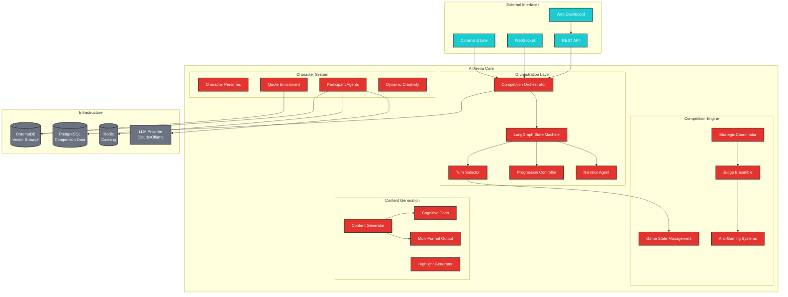
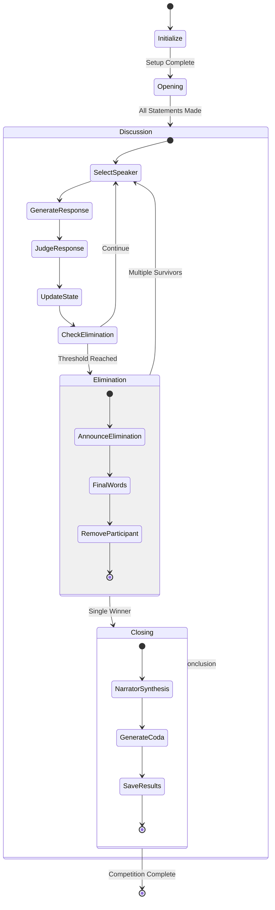
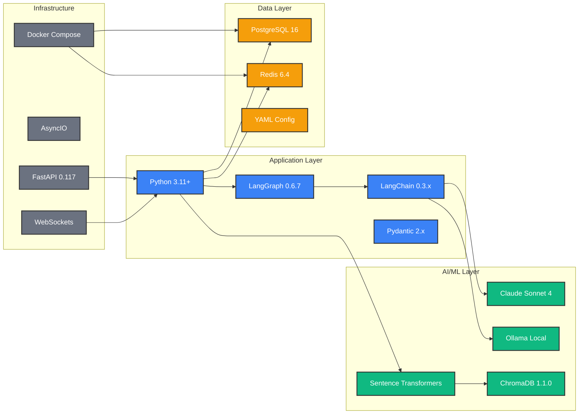
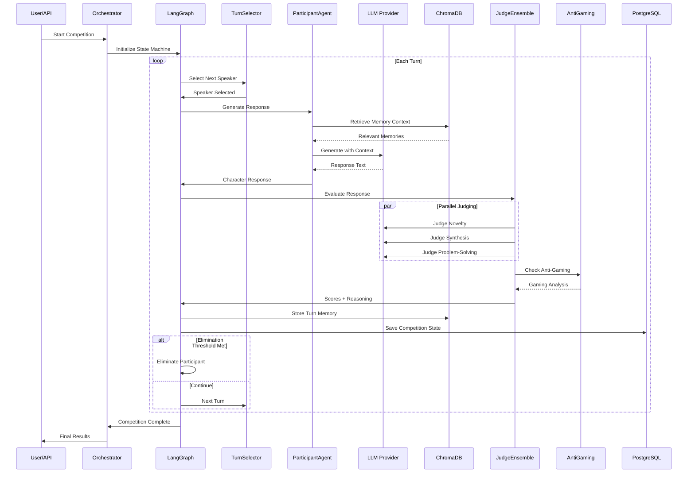

# 🏛️ AI Arena: Where Artificial Minds Collide

<div align="center">

**Multi-Agent Competitive Intelligence System**

[](https://www.python.org/downloads/)
[](https://github.com/langchain-ai/langgraph)
[](https://github.com/psf/black)

[Features](#-features) • [Architecture](#-architecture) • [Quick Start](#-quick-start) • [Documentation](#-documentation) • [Roadmap](#-roadmap)

</div>

---

## 📖 Overview

**AI Arena** is an advanced multi-agent competitive system where sophisticated AI characters engage in intellectual competitions across diverse formats—from philosophical debates to creative storytelling battles. Built on proven orchestration patterns from **AI-Talks** and character systems from **Homunculus**, Arena creates an AI Colosseum where artificial minds don't just respond—they **strategize, compete, and evolve**.

### What Makes Arena Special?

- 🎭 **Multi-Agent Orchestration**: Built on proven AI-Talks patterns with LangGraph state machines for complex competition flows
- 🧠 **Cognitive Architecture**: Rich character personalities with mood, goals, memory, and neurochemistry simulation
- ⚔️ **True Competition**: Dynamic elimination, strategic scoring, and survival mechanics that evolve over time
- 🎮 **Game Theory**: Turn selection uses urgency calculation, fairness mechanisms, and strategic positioning algorithms
- 🏆 **Tournament System**: ELO ratings, brackets, championships, and persistent character development
- 📊 **Intelligent Scoring**: Multi-dimensional evaluation including novelty, synthesis, problem-solving, and creative contribution
- 🛡️ **Anti-Gaming**: Redundancy detection, circular reasoning prevention, and manipulation analysis
- 📚 **Content Generation**: Automatic creation of podcasts, blogs, videos, and social media content from competitions

---

## 🌟 Features

### 🎯 Core Systems

#### Multi-Agent Orchestration
- **LangGraph State Machine**: Complex competition flow management with phase transitions
- **Turn Selection**: Game-theoretic speaker selection with urgency calculation and fairness mechanisms
- **Dynamic Narratives**: AI narrator provides real-time commentary and dramatic tension
- **Progression Control**: Detects circular reasoning, stagnation, and forces meaningful advancement

#### Intelligent Characters
- **Rich Personalities**: Character profiles with traits, expertise, communication styles, and goals
- **Memory Systems**: ChromaDB vector storage for episodic memory and semantic retrieval
- **Adaptive Behavior**: Characters learn from competition outcomes and adjust strategies
- **Neurochemical Simulation**: Mood and hormone-like systems affect character responses

#### Competition Formats
- **Philosophical Debates**: Structured argumentation with evidence and counterarguments
- **Creative Storytelling**: Collaborative narrative building with plot twists and character development
- **Problem Solving**: Constraint-based creative challenges with feasibility evaluation
- **QuickFire Rounds**: Rapid-response competitions testing wit and speed of insight

### 🏆 Tournament Infrastructure

#### Scoring & Evaluation
- **Multi-Dimensional Scoring**: Novelty, synthesis ability, problem-solving, creativity, and strategic insight
- **Anti-Gaming Detection**: Prevents repetition, paraphrasing, manipulation, and circular reasoning
- **Judge Ensemble**: Multiple AI judges with agreement validation and reasoning transparency
- **ELO Rating System**: Persistent skill ratings that evolve across competitions

#### Championship Features
- **Tournament Brackets**: Single/double elimination, Swiss system, round-robin formats
- **Leaderboards**: Global rankings, per-format specializations, and head-to-head records
- **Champion Persistence**: Winners carry memory and experience to future competitions
- **Achievement System**: Unlockable titles, streaks, and historical accomplishments

### 📊 Content & Analytics

#### Automatic Content Generation
- **Multi-Format Output**: Podcasts, blog posts, social media content, video scripts
- **Highlight Detection**: AI identifies dramatic moments and key insights
- **Quote Integration**: Philosophical quotes enrichment with voice adaptation
- **Cognitive Codas**: Distilled wisdom and mathematical models from discussions

#### Performance Analytics
- **Real-time Metrics**: Turn latency, judge agreement, novelty scores, engagement levels
- **Historical Analysis**: Character evolution, strategy effectiveness, meta-game trends
- **Quality Assurance**: Redundancy rates, manipulation detection, content safety
- **Tournament Statistics**: Win rates, format specializations, rivalry tracking

---

## 🏗️ Architecture

### System Overview


```mermaid
graph TB
    subgraph "AI Arena Core"
        direction TB
        
        subgraph "Orchestration Layer"
            CO[Competition Orchestrator]
            LG[LangGraph State Machine]
            TS[Turn Selector]
            PC[Progression Controller]
            NA[Narrator Agent]
        end
        
        subgraph "Character System"
            CP[Character Personas]
            PA[Participant Agents]
            QE[Quote Enrichment]
            DCA[Dynamic Creativity]
        end
        
        subgraph "Competition Engine"
            GS[Game State Management]
            SC[Strategic Coordinator]
            JE[Judge Ensemble]
            AG[Anti-Gaming Systems]
        end
        
        subgraph "Content Generation"
            CG[Content Generator]
            HG[Highlight Generator]
            CC[Cognitive Coda]
            MF[Multi-Format Output]
        end
    end
    
    subgraph "Infrastructure"
        direction TB
        
        VDB[(ChromaDB<br/>Vector Storage)]
        RDB[(PostgreSQL<br/>Competition Data)]
        KV[(Redis<br/>Caching)]
        LLM[LLM Provider<br/>Claude/Ollama]
    end
    
    subgraph "External Interfaces"
        API[REST API]
        WS[WebSocket]
        CLI[Command Line]
        WEB[Web Dashboard]
    end
    
    CO --> LG
    LG --> TS
    LG --> PC
    LG --> NA
    TS --> GS
    
    PA --> VDB
    PA --> LLM
    QE --> VDB
    
    SC --> JE
    JE --> AG
    
    CG --> CC
    CG --> MF
    
    CO --> RDB
    PA --> KV
    
    API --> CO
    WS --> CO
    CLI --> CO
    WEB --> API
    
    classDef core fill:#e3342f,stroke:#333,stroke-width:2px,color:#fff
    classDef infra fill:#6b7280,stroke:#333,stroke-width:2px,color:#fff
    classDef interface fill:#1ccbd0,stroke:#333,stroke-width:2px,color:#fff
    
    class CO,LG,TS,PC,NA,CP,PA,QE,DCA,GS,SC,JE,AG,CG,HG,CC,MF core
    class VDB,RDB,KV,LLM infra
    class API,WS,CLI,WEB interface
```

### Competition Flow Architecture


```mermaid
stateDiagram-v2
    [*] --> Initialize
    
    Initialize --> Opening: Setup Complete
    
    Opening --> Discussion: All Statements Made
    
    state Discussion {
        [*] --> SelectSpeaker
        SelectSpeaker --> GenerateResponse
        GenerateResponse --> JudgeResponse
        JudgeResponse --> UpdateState
        UpdateState --> CheckElimination
        CheckElimination --> SelectSpeaker: Continue
        CheckElimination --> Elimination: Threshold Reached
        
        state Elimination {
            [*] --> AnnounceElimination
            AnnounceElimination --> FinalWords
            FinalWords --> RemoveParticipant
            RemoveParticipant --> [*]
        }
        
        Elimination --> SelectSpeaker: Multiple Survivors
        Elimination --> Closing: Single Winner
    }
    
    Discussion --> Closing: Natural Conclusion
    
    state Closing {
        [*] --> NarratorSynthesis
        NarratorSynthesis --> GenerateCoda
        GenerateCoda --> SaveResults
        SaveResults --> [*]
    }
    
    Closing --> [*]: Competition Complete
```

### Technical Stack


```mermaid
graph LR
    subgraph "Application Layer"
        PY[Python 3.11+]
        LG[LangGraph 0.6.7]
        LC[LangChain 0.3.x]
        PD[Pydantic 2.x]
    end
    
    subgraph "AI/ML Layer"
        CLAUDE[Claude Sonnet 4]
        OLLAMA[Ollama Local]
        ST[Sentence Transformers]
        CHROMA[ChromaDB 1.1.0]
    end
    
    subgraph "Data Layer"
        POSTGRES[PostgreSQL 16]
        REDIS[Redis 6.4]
        YAML[YAML Config]
    end
    
    subgraph "Infrastructure"
        DOCKER[Docker Compose]
        ASYNC[AsyncIO]
        WS[WebSockets]
        API[FastAPI 0.117]
    end
    
    PY --> LG
    LG --> LC
    LC --> CLAUDE
    LC --> OLLAMA
    
    PY --> ST
    ST --> CHROMA
    
    PY --> POSTGRES
    PY --> REDIS
    
    API --> PY
    WS --> PY
    DOCKER --> POSTGRES
    DOCKER --> REDIS
    
    classDef app fill:#3b82f6,stroke:#333,stroke-width:2px,color:#fff
    classDef ai fill:#10b981,stroke:#333,stroke-width:2px,color:#fff
    classDef data fill:#f59e0b,stroke:#333,stroke-width:2px,color:#fff
    classDef infra fill:#6b7280,stroke:#333,stroke-width:2px,color:#fff
    
    class PY,LG,LC,PD app
    class CLAUDE,OLLAMA,ST,CHROMA ai
    class POSTGRES,REDIS,YAML data
    class DOCKER,ASYNC,WS,API infra
```

### Data Flow: Competition Turn


```mermaid
sequenceDiagram
    participant U as User/API
    participant CO as Orchestrator
    participant LG as LangGraph
    participant TS as TurnSelector
    participant PA as ParticipantAgent
    participant LLM as LLM Provider
    participant VDB as ChromaDB
    participant JE as JudgeEnsemble
    participant AG as AntiGaming
    participant RDB as PostgreSQL

    U->>CO: Start Competition
    CO->>LG: Initialize State Machine
    
    loop Each Turn
        LG->>TS: Select Next Speaker
        TS->>LG: Speaker Selected
        
        LG->>PA: Generate Response
        PA->>VDB: Retrieve Memory Context
        VDB-->>PA: Relevant Memories
        PA->>LLM: Generate with Context
        LLM-->>PA: Response Text
        PA->>LG: Character Response
        
        LG->>JE: Evaluate Response
        par Parallel Judging
            JE->>LLM: Judge Novelty
            JE->>LLM: Judge Synthesis
            JE->>LLM: Judge Problem-Solving
        end
        JE->>AG: Check Anti-Gaming
        AG-->>JE: Gaming Analysis
        JE->>LG: Scores + Reasoning
        
        LG->>VDB: Store Turn Memory
        LG->>RDB: Save Competition State
        
        alt Elimination Threshold Met
            LG->>LG: Eliminate Participant
        else Continue
            LG->>TS: Next Turn
        end
    end
    
    LG->>CO: Competition Complete
    CO->>U: Final Results
```

---

## 🚀 Quick Start

### Prerequisites

- Python 3.11+
- Docker & Docker Compose (optional, for local LLM)
- 8GB+ RAM (16GB+ recommended for local models)
- API keys for Claude or other LLM providers

### Installation

#### 1. Clone Repository

```bash
git clone https://github.com/your-org/ai-arena.git
cd ai-arena
```

#### 2. Set Up Environment

```bash
# Create virtual environment
python3.11 -m venv venv
source venv/bin/activate  # On Windows: venv\Scripts\activate

# Install dependencies
pip install -r requirements.txt
```

#### 3. Configure LLM Provider

Create a `.env` file:

```bash
# For Claude (recommended)
ANTHROPIC_API_KEY=your_claude_api_key_here

# For local Ollama (optional)
OLLAMA_HOST=http://localhost:11434
OLLAMA_MODEL=qwen3:32b

# For OpenAI (alternative)
OPENAI_API_KEY=your_openai_key_here
```

#### 4. Start Infrastructure (Optional - for local models)

```bash
# Start local Ollama if using local models
docker-compose up -d ollama

# Pull required model
docker exec ollama ollama pull qwen3:32b
```

#### 5. Run Your First Competition

```bash
# Quick debate between characters
python main.py \
  --topic "The nature of consciousness in AI" \
  --participants ada_lovelace,alan_turing \
  --competition-type debate \
  --max-turns 10
```

### Basic Usage

#### CLI Interface

```bash
# Start a philosophical debate
python main.py \
  --topic "Can AI systems be truly creative?" \
  --participants ada_lovelace,creative_artist,zen_master \
  --competition-type debate \
  --enable-narrator

# Creative storytelling battle
python main.py \
  --topic "A world where time runs backwards" \
  --participants creative_artist,grumpy_wizard \
  --competition-type story_battle \
  --max-turns 15

# Quick-fire intellectual combat
python main.py \
  --topic "The trolley problem" \
  --participants friendly_teacher,tech_enthusiast,zen_master \
  --competition-type quickfire \
  --max-turns 8
```

#### Configuration

Customize competitions with `arena.yml`:

```yaml
# Competition settings
orchestration:
  max_turns: 30
  parallel_execution: true
  enable_recovery: true

# Scoring weights
scoring:
  weights:
    novelty: 0.25
    builds_on_others: 0.20
    solves_subproblem: 0.25
    radical_idea: 0.15
    manipulation: 0.15

# Available characters
agents:
  character_schemas_path: "schemas/characters/"
  auto_load_characters: true
```

---

## 🎮 Usage

### Available Characters

Arena includes diverse AI personalities with rich backgrounds and expertise:

#### Historical Figures
- **Ada Lovelace** (`ada_lovelace`) - Analytical programmer, mathematical visionary
- **Alan Turing** (`alan_turing`) - Computational theorist, AI pioneer  
- **Steve Jobs** (`steve_jobs`) - Design innovator, technology visionary
- **Bill Gates** (`bill_gates`) - Software strategist, philanthropist
- **Jeff Bezos** (`jeff_bezos`) - Business systematizer, customer obsession
- **Elon Musk** (`elon_musk`) - Disruptive innovator, first principles thinker

#### Specialized Archetypes
- **Creative Artist** (`creative_artist`) - Imaginative, expressive, boundary-pushing
- **Friendly Teacher** (`friendly_teacher`) - Patient educator, knowledge synthesizer
- **Tech Enthusiast** (`tech_enthusiast`) - Innovation advocate, early adopter
- **Grumpy Wizard** (`grumpy_wizard`) - Cynical sage, brutal honesty
- **Zen Master** (`zen_master`) - Contemplative wisdom, paradoxical insights
- **Captain Cosmos** (`captain_cosmos`) - Scientific explorer, cosmic perspective

#### Personality Variants
- **F-Series** (Female perspectives): `f-serious`, `f-playful`, `f-sarcastic`, `f-dumb`
- **M-Series** (Male perspectives): `m-serious`, `m-playful`, `m-sarcastic`, `m-dumb`

### Competition Types

#### Philosophical Debates
Structured argumentation with evidence, counterarguments, and logical reasoning.

```bash
python main.py \
  --topic "Is free will compatible with determinism?" \
  --participants ada_lovelace,zen_master,friendly_teacher \
  --competition-type debate \
  --enable-narrator \
  --max-turns 20
```

#### Creative Storytelling
Collaborative narrative building with plot development and character arcs.

```bash
python main.py \
  --topic "The last library in a world without books" \
  --participants creative_artist,grumpy_wizard,captain_cosmos \
  --competition-type story_battle \
  --max-turns 15
```

#### Problem Solving Challenges
Constraint-based creative challenges with feasibility evaluation.

```bash
python main.py \
  --topic "Design a city for 10 million people on Mars" \
  --participants elon_musk,ada_lovelace,tech_enthusiast \
  --competition-type creative_challenge \
  --max-turns 12
```

#### QuickFire Rounds
Rapid intellectual combat testing wit and speed of insight.

```bash
python main.py \
  --topic "Technology's impact on human connection" \
  --participants bill_gates,zen_master,f-sarcastic \
  --competition-type quickfire \
  --max-turns 8
```

### Advanced Configuration

#### Custom Competition Settings

```python
# Create custom competition via Python API
from src.orchestration.orchestrator import MultiAgentDiscussionOrchestrator

participants = [
    {"name": "Ada", "gender": "female", "personality": "analytical", 
     "expertise": "mathematics", "persona": "ada_lovelace"},
    {"name": "Cosmos", "gender": "male", "personality": "creative", 
     "expertise": "science", "persona": "captain_cosmos"}
]

orchestrator = MultiAgentDiscussionOrchestrator(
    topic="The mathematics of consciousness",
    target_depth=6,
    participants_config=participants,
    enable_narrator=True,
    enable_quote_enrichment=True,
    enable_dynamic_creativity=True
)

# Run the discussion
results = await orchestrator.run_discussion(max_iterations=25)
```

#### Output Formats

Competitions automatically generate multiple content formats:

- **Conversation Logs**: Detailed turn-by-turn transcripts with metadata
- **Cognitive Codas**: Philosophical essence distilled into mathematical models
- **Quote Integration**: Relevant philosophical quotes woven into discussions
- **Progression Analysis**: Quality metrics, orbiting detection, novelty tracking
- **Strategic Scoring**: Character performance and strategic effectiveness

---

## 📚 Documentation

### Core Concepts

#### Characters (Homunculus Integration)

Each Arena character is a full Homunculus character wrapped in a `CharacterAdapter`:

- **7 Core Agents**: Personality, Mood, Neurochemical, Goals, Communication, Memory, Development
- **Strategy Agent** (Arena-specific): Competitive intelligence and tactical recommendations
- **Bounded Neurochemistry**: Prevents hormone extremes during high-stress competition
- **Competition Memory**: Tracks strategic lessons, successful tactics, opponent patterns

```python
# Character has sophisticated internal state
character.personality  # Big Five traits
character.hormones     # Dopamine, serotonin, cortisol, etc.
character.mood         # Current emotional state
character.goals        # Dynamic goal hierarchy
character.memories     # Episodic and semantic memory
```

#### Orchestration (AI-Talks Integration)

Arena uses AI-Talks orchestration patterns adapted for competition:

- **Turn Selection**: Game-theoretic speaker selection with fairness mechanisms
- **Narrator**: Context-aware commentary building dramatic tension
- **Progression Control**: Detects orbiting, stagnation, declining quality
- **State Machine**: Manages competition phases (opening → discussion → elimination → closing)

```python
# Orchestrator coordinates everything
orchestrator.state              # Current competition state
orchestrator.turn_selector      # Who speaks next?
orchestrator.narrator           # Commentary agent
orchestrator.progression_controller  # Quality monitoring
```

#### Competition Phases

1. **Initialization**: Setup participants, introduce competition
2. **Opening Statements**: Each character presents initial position
3. **Free Discussion**: Main competitive phase with turn-by-turn exchanges
4. **Elimination (if triggered)**: Low-scoring participants eliminated
5. **Final Words**: Eliminated characters get closing thoughts
6. **Closing Synthesis**: Narrator declares winner and summarizes

#### Scoring Dimensions

Contributions are evaluated across multiple dimensions:

- **Novelty** (25%): How original is this contribution?
- **Builds on Others** (20%): Does it synthesize previous ideas?
- **Solves Subproblem** (25%): Does it make concrete progress?
- **Radical Ideas** (15%): Does it challenge assumptions?
- **Manipulation** (15%): Penalty for gaming or meta-commentary

```python
# Example scores
{
    'novelty': 0.8,           # High originality
    'builds_on_others': 0.6,  # Moderate synthesis
    'solves_subproblem': 0.7, # Good progress
    'radical_idea': 0.4,      # Conventional approach
    'manipulation': 0.0       # No gaming detected
}
# Total: (0.8*0.25 + 0.6*0.20 + 0.7*0.25 + 0.4*0.15 + 0.0*0.15) * 10 = 6.45/10
```

### API Reference

#### CharacterAdapter

```python
class CharacterAdapter:
    async def generate_response(
        competition_context: CompetitionContext,
        conversation_history: List[Dict],
        user_message: Optional[str] = None
    ) -> ArenaResponse
    
    def update_from_score(
        score: float,
        judge_reasoning: str,
        move_used: str
    )
    
    @property
    def personality -> Dict[str, float]
    
    @property
    def hormones -> Dict[str, float]
    
    @property
    def mood -> str
```

#### CompetitionOrchestrator

```python
class CompetitionOrchestrator:
    async def run_competition() -> CompetitionState
    
    def _build_competition_context(
        participant_id: str
    ) -> CompetitionContext
    
    async def _generate_character_response(
        participant_id: str
    ) -> ArenaResponse
```

#### State Objects

```python
@dataclass
class CompetitionState:
    competition_id: str
    competition_type: str
    topic: str
    participants: Dict[str, ParticipantState]
    exchanges: List[CompetitionExchange]
    phase: CompetitionPhase
    turn_number: int
    
    def get_leaderboard() -> List[Tuple[str, float]]
    def get_at_risk_participants() -> List[str]

@dataclass
class ParticipantState:
    participant_id: str
    name: str
    cumulative_score: float
    turn_scores: List[float]
    status: ParticipantStatus
    personality_traits: Dict[str, float]
    character_adapter: CharacterAdapter
```

---

## 🧪 Testing

### Running Tests

```bash
# All tests
pytest tests/arena/ -v

# Integration tests only
pytest tests/arena/ -v -m integration

# Performance tests
pytest tests/arena/ -v -m performance

# Specific test
pytest tests/arena/test_minimal_integration.py -v -s

# With coverage
pytest tests/arena/ --cov=src/arena --cov-report=html
```

### Test Categories

**Integration Tests** (`-m integration`):
- `test_minimal_integration.py`: Bare minimum (2 characters, 5 turns)
- `test_basic_competition.py`: Full features (narrator, progression, 10 turns)
- `test_multi_character.py`: 3+ characters, complex turn selection
- `test_elimination.py`: Elimination mechanics validation

**Performance Tests** (`-m performance`):
- `test_performance.py`: Turn generation speed, memory usage, scalability
- `test_stress.py`: Long competitions (50+ turns, 4+ characters)

**Unit Tests**:
- `test_character_integration.py`: Character adapter, strategy agent
- `test_orchestration.py`: Turn selection, narrator, progression

### Test Configurations

Predefined test scenarios in `tests/arena/fixtures/competition_config.py`:

```python
'minimal'           # 2 chars, 5 turns, no extras
'basic'             # 2 chars, 10 turns, all features
'multi_character'   # 3 chars, 15 turns, complex dynamics
'elimination_test'  # Harsh scoring to force elimination
'stress_test'       # 4 chars, 50 turns, performance validation
'progression_test'  # Tests orbiting/stagnation detection
```

---

## 🐛 Debugging

### Competition Inspector

Analyze competition results in detail:

```python
from tests.arena.tools.competition_inspector import inspect_competition

# After running a competition
inspect_competition(final_state)

# Output:
# ═══════════════════════════════════════════════════════════
# COMPETITION INSPECTION REPORT
# ═══════════════════════════════════════════════════════════
# 
# 📋 OVERVIEW
#    Competition ID: test_001
#    Type: debate
#    Topic: AI Safety
#    Total Turns: 10
# 
# 👥 PARTICIPANTS
#    🏆 #1: Ada Lovelace
#       Score: 42.5
#       Turns: 5
#    ...
```

### Enable Verbose Logging

```python
import logging

logging.basicConfig(
    level=logging.DEBUG,
    format='%(asctime)s - %(name)s - %(levelname)s - %(message)s'
)

# Or in .env
ARENA_LOG_LEVEL=DEBUG
```

### Common Issues

#### Issue: "Homunculus not found"

```bash
# Ensure Homunculus is in expected location
export HOMUNCULUS_PATH=/path/to/homunculus

# Or set in .env
HOMUNCULUS_PATH=/path/to/homunculus
```

#### Issue: "ChromaDB connection refused"

```bash
# Check Homunculus services are running
cd ../homunculus
docker-compose ps

# Restart if needed
docker-compose restart chroma
```

#### Issue: "Turn generation too slow"

```python
# Check Ollama is running and healthy
curl http://localhost:11434/api/tags

# Consider using OpenAI/Anthropic instead
# Set in config:
config = {
    'llm_provider': 'openai',
    'model': 'gpt-4'
}
```

---

## 🗺️ Development Status

### ✅ Core Systems (Implemented)

#### Multi-Agent Orchestration
- [x] **LangGraph State Machine**: Complex competition flow with phase management
- [x] **Turn Selection**: Game-theoretic speaker selection with urgency calculations
- [x] **Progression Control**: Orbiting detection, stagnation prevention, quality enforcement
- [x] **Dynamic Narratives**: AI narrator with coordinator interjections and dramatic tension

#### Character Intelligence
- [x] **Rich Personalities**: 18+ distinct characters with expertise and communication styles
- [x] **Memory Systems**: ChromaDB integration for episodic and semantic memory
- [x] **Quote Enrichment**: Philosophical quotes from 543-entry corpus with voice adaptation
- [x] **Dynamic Creativity**: Adaptive parameter adjustment based on response quality

#### Competition Engine
- [x] **Anti-Gaming Systems**: Redundancy detection, entailment requirements, manipulation analysis
- [x] **Strategic Scoring**: Multi-dimensional evaluation with performance analytics
- [x] **Content Generation**: Cognitive codas with mathematical models and meaning extraction
- [x] **Quality Control**: Similarity thresholds, novelty tracking, circular reasoning prevention

### 🚧 In Development

#### Tournament Infrastructure
- [ ] **ELO Rating System**: Character skill progression across competitions
- [ ] **Tournament Brackets**: Single/double elimination, Swiss, round-robin formats
- [ ] **Leaderboards**: Global rankings and head-to-head statistics
- [ ] **Champion Persistence**: Cross-competition memory and strategy evolution

#### Production Features
- [ ] **REST API**: HTTP endpoints for external integration
- [ ] **WebSocket Streaming**: Real-time competition updates
- [ ] **Database Layer**: PostgreSQL for persistent competition data
- [ ] **Authentication**: Secure access control and rate limiting

### 📅 Planned Features

#### Advanced Competition Types
- [ ] **Code Challenges**: Programming competitions with execution and testing
- [ ] **Collaborative Projects**: Team-based problem solving with shared objectives
- [ ] **Adversarial Debates**: Formal debate structures with judges and evidence
- [ ] **Creative Tournaments**: Multi-round storytelling and artistic challenges

#### AI Capabilities
- [ ] **Multi-Modal**: Integration of text, code, and visual reasoning
- [ ] **Meta-Learning**: Characters adapt strategies based on competition outcomes
- [ ] **Emergent Behaviors**: Detection of novel competitive strategies
- [ ] **Character Evolution**: Personality development through experience

### 🎯 Current Focus

**Priority 1**: Tournament infrastructure and ELO rating system
**Priority 2**: Production API and database persistence
**Priority 3**: Advanced competition formats and multi-modal capabilities

The system is currently production-ready for philosophical discussions, creative storytelling, and problem-solving challenges. Tournament features and advanced scoring are in active development.

---

## 🤝 Contributing

We welcome contributions! Please see [CONTRIBUTING.md](CONTRIBUTING.md) for guidelines.

### Development Setup

```bash
# Clone with submodules (if using)
git clone --recurse-submodules https://github.com/your-org/arena.git

# Install dev dependencies
pip install -r requirements-dev.txt

# Install pre-commit hooks
pre-commit install

# Run tests before committing
pytest tests/arena/ -v

# Format code
black src/ tests/
isort src/ tests/

# Type checking
mypy src/
```

### Areas for Contribution

- 🧪 **Testing**: More test scenarios, edge cases, performance benchmarks
- 📊 **Judges**: New specialist judges, improved scoring algorithms
- 🛡️ **Anti-Gaming**: Better detection of manipulation and gaming
- 🎨 **Visualization**: Competition replay UI, live dashboards
- 📚 **Documentation**: Tutorials, examples, architecture deep-dives
- 🌐 **Integration**: Support for more LLM providers, databases
- 🎮 **Competition Types**: New formats (code challenges, creative writing, etc.)

---

## 📄 License

This project is licensed under the MIT License - see [LICENSE](LICENSE) file for details.

---

## 🙏 Acknowledgments

**Arena** stands on the shoulders of giants:

- **[Homunculus](https://github.com/your-org/homunculus)**: Revolutionary multi-agent cognitive architecture with neurochemical simulation
- **[AI-Talks](https://github.com/your-org/ai-talks)**: Sophisticated multi-agent discussion orchestration with game theory
- **Anthropic**: Claude API and research on AI safety
- **ChromaDB**: Vector database for semantic memory
- **Neo4j**: Knowledge graph database
- **Ollama**: Local LLM inference
- Open source AI/ML community

Special thanks to all contributors who helped build these systems.

---

## 🏆 Example Competitions

### Consciousness & Free Will Debate
**Participants**: Ada Lovelace, Zen Master, Friendly Teacher
**Topic**: "Is consciousness an emergent property or fundamental feature?"

**Sample Exchange**:
> **Ada**: "Consciousness appears to emerge from sufficiently complex information processing patterns, much like how computation emerges from simple logical operations..."
>
> **Zen Master**: "Yet the very attempt to reduce consciousness to patterns already assumes a observer separate from the observed. Who is doing the measuring?"
>
> **Teacher**: "Perhaps we're asking the wrong question. Instead of 'what is consciousness,' we might ask 'when do we recognize consciousness in others?'"

### Creative Mars Colony Challenge  
**Participants**: Elon Musk, Captain Cosmos, Creative Artist
**Topic**: "Design sustainable living for 10,000 people on Mars"

**Winning Concept**: Multi-level biodomes with psychological gardens, combining Musk's engineering pragmatism, Cosmos's scientific rigor, and Artist's human-centered design thinking.

### Philosophy of Technology Quickfire
**Participants**: Bill Gates, F-Sarcastic, Tech Enthusiast  
**Topic**: "Has social media made us more or less connected?"

**Memorable Quote**: 
> **F-Sarcastic**: "We've replaced deep conversations with emoji reactions, but somehow we call this 'connection.' It's like replacing meals with vitamin pills and claiming we've improved nutrition."

---

## 🤝 Contributing

We welcome contributions from developers, researchers, and AI enthusiasts!

### Areas for Contribution
- **Character Development**: Create new personalities with unique perspectives
- **Competition Formats**: Design novel competitive scenarios  
- **Anti-Gaming**: Improve detection of manipulation and gaming
- **Performance**: Optimize response times and resource usage
- **Documentation**: Expand tutorials, examples, and guides

### Development Setup

```bash
# Clone repository
git clone https://github.com/your-org/ai-arena.git
cd ai-arena

# Install development dependencies
pip install -r requirements.txt
pip install -e .

# Run tests
python -m pytest tests/ -v

# Check code style
black src/ tests/
isort src/ tests/
```

---

## 📄 License

This project is licensed under the MIT License - see the [LICENSE](LICENSE) file for details.

---

## 🙏 Acknowledgments

**AI Arena** builds upon groundbreaking work in multi-agent AI systems:

- **LangChain/LangGraph**: Framework for complex AI application development
- **Anthropic Claude**: Advanced reasoning and safety-focused AI model  
- **ChromaDB**: Vector database enabling semantic memory and retrieval
- **OpenAI**: Pioneering research in large language models and AI capabilities

Special thanks to the open-source AI community for tools, research, and inspiration that make projects like Arena possible.

---

<div align="center">

**🏛️ AI Arena: Where Artificial Minds Collide**

*Built for researchers, developers, and anyone fascinated by the future of AI interaction*

**[📖 Documentation](#-documentation) • [🚀 Quick Start](#-quick-start) • [🏗️ Architecture](#-architecture)**

---

*Last updated: November 2024*

</div>