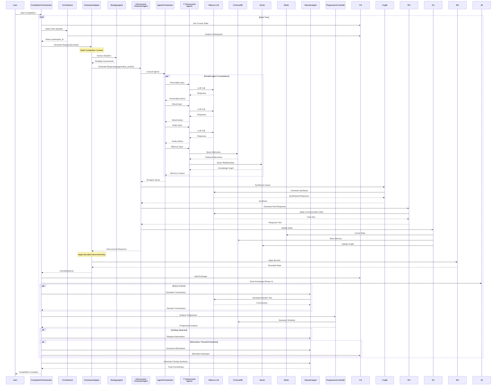
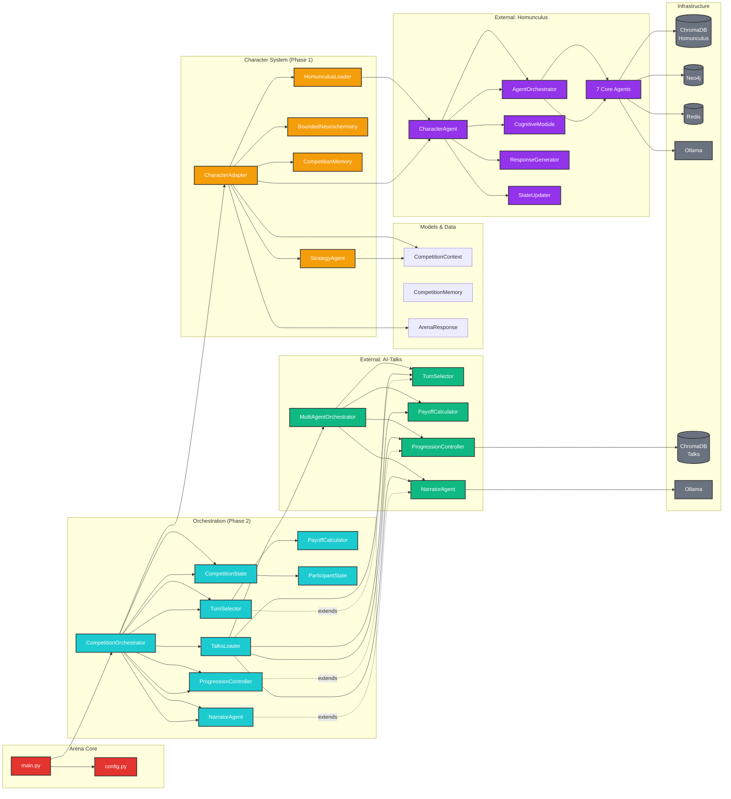
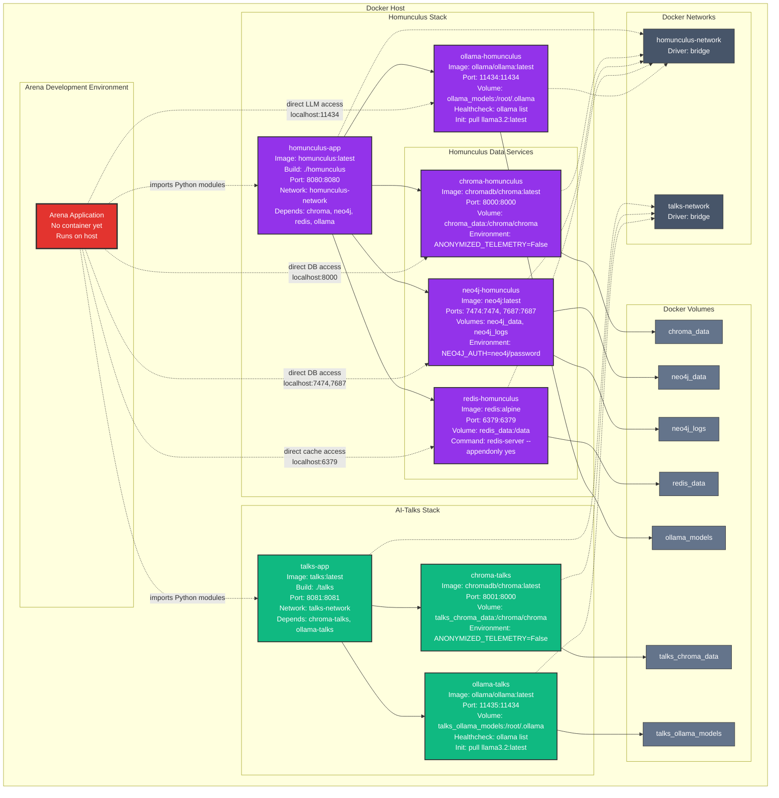

# 🏗️ ARENA ARCHITECTURE DIAGRAMS

## Complete System Architecture Diagram

```mermaid
graph TB
    subgraph "Arena Application Layer"
        subgraph "Phase 1: Character System"
            CA[CharacterAdapter]
            SA[StrategyAgent]
            BN[BoundedNeurochemistry]
            CM[CompetitionMemory]
            HL[HomunculusLoader]
        end
        
        subgraph "Phase 2: Orchestration System"
            CO[CompetitionOrchestrator]
            TS[TurnSelector]
            NA[NarratorAgent]
            PC[ProgressionController]
            CS[CompetitionState]
            PS[ParticipantState]
            TL[TalksLoader]
        end
        
        subgraph "Phase 4: Judge System (Future)"
            JE[JudgeEnsemble]
            JS[JudgeSpecialist]
            JC[JudgeCoordinator]
        end
        
        subgraph "Phase 5: Anti-Gaming (Future)"
            PD[ParaphrasingDetector]
            MD[ManipulationDetector]
            ED[EntailmentDetector]
        end
    end
    
    subgraph "Homunculus External Components"
        subgraph "Homunculus Character Agent"
            HCA[CharacterAgent]
            AO[AgentOrchestrator]
            
            subgraph "7 Core Agents"
                PA[PersonalityAgent]
                MA[MoodAgent]
                NA2[NeurochemicalAgent]
                GA[GoalsAgent]
                CA2[CommunicationAgent]
                MeA[MemoryAgent]
                DA[DevelopmentAgent]
            end
            
            CogM[CognitiveModule]
            RG[ResponseGenerator]
            SU[StateUpdater]
        end
        
        subgraph "Homunculus Infrastructure"
            ChromaH[(ChromaDB<br/>Homunculus)]
            Neo4jH[(Neo4j<br/>Homunculus)]
            RedisH[(Redis<br/>Homunculus)]
        end
        
        OllamaH[Ollama<br/>llama3.2:latest]
    end
    
    subgraph "AI-Talks External Components"
        subgraph "AI-Talks Orchestration"
            MADO[MultiAgentDiscussion<br/>Orchestrator]
            TurnS[TurnSelector]
            PayoffC[PayoffCalculator]
            NarrA[NarratorAgent]
            ProgC[ProgressionController]
        end
        
        subgraph "AI-Talks Infrastructure"
            ChromaT[(ChromaDB<br/>AI-Talks)]
        end
        
        OllamaT[Ollama<br/>llama3.2:latest]
    end
    
    subgraph "Shared Infrastructure"
        LLMProvider[LLM Provider<br/>Ollama/OpenAI/Anthropic]
        VectorDB[(Vector Database<br/>Embeddings)]
    end
    
    %% Arena Internal Connections
    CO -->|creates| CA
    CO -->|manages| CS
    CO -->|uses| TS
    CO -->|uses| NA
    CO -->|uses| PC
    
    CA -->|wraps| HL
    CA -->|contains| SA
    CA -->|uses| BN
    CA -->|creates| CM
    
    CS -->|contains| PS
    TS -->|selects from| PS
    
    %% Arena -> Homunculus Connections
    HL -->|loads| HCA
    CA -->|delegates to| HCA
    
    HCA -->|coordinates| AO
    AO -->|consults| PA
    AO -->|consults| MA
    AO -->|consults| NA2
    AO -->|consults| GA
    AO -->|consults| CA2
    AO -->|consults| MeA
    AO -->|consults| DA
    
    AO -->|synthesizes with| CogM
    CogM -->|generates via| RG
    HCA -->|updates state| SU
    
    HCA -->|queries| ChromaH
    HCA -->|queries| Neo4jH
    HCA -->|caches in| RedisH
    
    PA -->|calls| OllamaH
    MA -->|calls| OllamaH
    NA2 -->|calls| OllamaH
    GA -->|calls| OllamaH
    CA2 -->|calls| OllamaH
    MeA -->|calls| OllamaH
    DA -->|calls| OllamaH
    CogM -->|calls| OllamaH
    RG -->|calls| OllamaH
    
    %% Arena -> AI-Talks Connections
    TL -->|loads| MADO
    CO -->|adapts from| MADO
    TS -->|extends| TurnS
    TS -->|uses| PayoffC
    NA -->|extends| NarrA
    PC -->|extends| ProgC
    
    NarrA -->|calls| OllamaT
    ProgC -->|queries| ChromaT
    
    %% Shared Infrastructure
    OllamaH -.->|shared instance| LLMProvider
    OllamaT -.->|shared instance| LLMProvider
    ChromaH -.->|could share| VectorDB
    ChromaT -.->|could share| VectorDB
    
    %% Future Connections
    CO -.->|will use| JE
    JE -.->|coordinates| JS
    JE -.->|uses| JC
    
    PC -.->|will use| PD
    PC -.->|will use| MD
    PC -.->|will use| ED
    
    classDef arenaPhase1 fill:#e3342f,stroke:#333,stroke-width:2px,color:#fff
    classDef arenaPhase2 fill:#1ccbd0,stroke:#333,stroke-width:2px,color:#fff
    classDef arenaFuture fill:#f59e0b,stroke:#333,stroke-width:2px,color:#fff
    classDef homunculus fill:#9333ea,stroke:#333,stroke-width:2px,color:#fff
    classDef talks fill:#10b981,stroke:#333,stroke-width:2px,color:#fff
    classDef infrastructure fill:#6b7280,stroke:#333,stroke-width:2px,color:#fff
    
    class CA,SA,BN,CM,HL arenaPhase1
    class CO,TS,NA,PC,CS,PS,TL arenaPhase2
    class JE,JS,JC,PD,MD,ED arenaFuture
    class HCA,AO,PA,MA,NA2,GA,CA2,MeA,DA,CogM,RG,SU arenaPhase1
    class MADO,TurnS,PayoffC,NarrA,ProgC arenaPhase2
    class ChromaH,Neo4jH,RedisH,OllamaH,ChromaT,OllamaT,LLMProvider,VectorDB infrastructure
```



---

## External Infrastructure Architecture (Based on docker-compose.yml)

```mermaid
graph TB
    subgraph "Arena Container Network"
        Arena[Arena Application<br/>Python 3.11]
    end
    
    subgraph "Homunculus Container Network"
        direction TB
        
        HomunculusApp[Homunculus Application<br/>Python 3.11<br/>Port: 8080]
        
        subgraph "Homunculus Data Layer"
            ChromaH[ChromaDB<br/>chromadb/chroma:latest<br/>Port: 8000<br/>Volume: chroma_data]
            
            Neo4jH[Neo4j<br/>neo4j:latest<br/>Ports: 7474, 7687<br/>Volume: neo4j_data<br/>Auth: neo4j/password]
            
            RedisH[Redis<br/>redis:alpine<br/>Port: 6379<br/>Volume: redis_data]
        end
        
        OllamaH[Ollama<br/>ollama/ollama:latest<br/>Port: 11434<br/>Volume: ollama_models<br/>Model: llama3.2:latest]
    end
    
    subgraph "AI-Talks Container Network"
        direction TB
        
        TalksApp[AI-Talks Application<br/>Python 3.11<br/>Port: 8081]
        
        ChromaT[ChromaDB<br/>chromadb/chroma:latest<br/>Port: 8001<br/>Volume: talks_chroma_data]
        
        OllamaT[Ollama<br/>ollama/ollama:latest<br/>Port: 11435<br/>Volume: talks_ollama_models<br/>Model: llama3.2:latest]
    end
    
    subgraph "Optional External Services"
        OpenAI[OpenAI API<br/>gpt-4, gpt-3.5-turbo]
        Anthropic[Anthropic API<br/>claude-sonnet-4]
    end
    
    %% Arena Connections
    Arena -->|imports & calls| HomunculusApp
    Arena -->|imports & calls| TalksApp
    Arena -->|direct DB access| ChromaH
    Arena -->|direct DB access| Neo4jH
    Arena -->|direct cache access| RedisH
    Arena -->|LLM calls| OllamaH
    
    %% Homunculus Internal Connections
    HomunculusApp -->|vector storage| ChromaH
    HomunculusApp -->|graph storage| Neo4jH
    HomunculusApp -->|caching| RedisH
    HomunculusApp -->|LLM inference| OllamaH
    
    %% AI-Talks Internal Connections
    TalksApp -->|vector storage| ChromaT
    TalksApp -->|LLM inference| OllamaT
    
    %% Optional External
    Arena -.->|optional| OpenAI
    Arena -.->|optional| Anthropic
    HomunculusApp -.->|optional| OpenAI
    TalksApp -.->|optional| Anthropic
    
    %% Network Connections
    HomunculusApp ---|homunculus-network| ChromaH
    HomunculusApp ---|homunculus-network| Neo4jH
    HomunculusApp ---|homunculus-network| RedisH
    HomunculusApp ---|homunculus-network| OllamaH
    
    TalksApp ---|talks-network| ChromaT
    TalksApp ---|talks-network| OllamaT
    
    Arena -.->|cross-network access| HomunculusApp
    Arena -.->|cross-network access| TalksApp
    
    classDef arena fill:#e3342f,stroke:#333,stroke-width:3px,color:#fff
    classDef homunculus fill:#9333ea,stroke:#333,stroke-width:2px,color:#fff
    classDef talks fill:#10b981,stroke:#333,stroke-width:2px,color:#fff
    classDef infrastructure fill:#6b7280,stroke:#333,stroke-width:2px,color:#fff
    classDef external fill:#3b82f6,stroke:#333,stroke-width:2px,color:#fff
    
    class Arena arena
    class HomunculusApp,ChromaH,Neo4jH,RedisH,OllamaH homunculus
    class TalksApp,ChromaT,OllamaT talks
    class OpenAI,Anthropic external
```



---

## Data Flow Architecture: Competition Turn



---

## Component Dependency Graph



---

## Docker Compose Infrastructure Diagram



---

## File System Architecture

```mermaid
graph TB
    subgraph "Project Root"
        direction TB
        
        subgraph "arena/"
            direction TB
            
            ArenaMain[main.py]
            ArenaConfig[config.py]
            
            subgraph "src/arena/"
                direction TB
                
                subgraph "character/"
                    CA_file[character_adapter.py]
                    HL_file[homunculus_loader.py]
                    
                    subgraph "agents/"
                        SA_file[strategy_agent.py]
                    end
                    
                    subgraph "modules/"
                        BN_file[bounded_neurochemistry.py]
                    end
                    
                    subgraph "memory/"
                        CM_file[competition_memory.py]
                    end
                    
                    subgraph "models/"
                        CCM_file[competition_context.py]
                    end
                end
                
                subgraph "orchestration/"
                    CO_file[competition_orchestrator.py]
                    TL_file[talks_loader.py]
                    
                    subgraph "agents/"
                        NA_file[narrator_agent.py]
                        TSA_file[turn_selector_agent.py]
                    end
                    
                    subgraph "game_theory/"
                        TS_file[turn_selector.py]
                        PC_file[payoff_calculator.py]
                    end
                    
                    subgraph "controllers/"
                        PRC_file[progression_controller.py]
                    end
                    
                    subgraph "states/"
                        CS_file[competition_state.py]
                        PS_file[participant_state.py]
                    end
                end
            end
            
            subgraph "tests/arena/"
                direction TB
                Test1[test_minimal_integration.py]
                Test2[test_basic_competition.py]
                Test3[test_multi_character.py]
                
                subgraph "fixtures/"
                    Config_file[competition_config.py]
                    Runner_file[test_runner.py]
                end
            end
            
            subgraph "docs/"
                Doc1[phase1_character_system.md]
                Doc2[phase2_orchestration.md]
                Doc3[phase3_integration.md]
            end
        end
        
        subgraph "homunculus/ (External)"
            direction TB
            
            HDockerfile[Dockerfile]
            HCompose[docker-compose.yml]
            
            subgraph "src/"
                HMain[character_agent.py]
                
                subgraph "agents/"
                    HAgents[personality_agent.py<br/>mood_agent.py<br/>neurochemical_agent.py<br/>goals_agent.py<br/>communication_style_agent.py<br/>memory_agent.py<br/>development_agent.py]
                end
                
                subgraph "modules/"
                    HAO[agent_orchestrator.py]
                    HCM[cognitive_module.py]
                    HRG[response_generator.py]
                end
                
                subgraph "core/"
                    HCS[character_state.py]
                    HExp[experience.py]
                end
                
                subgraph "memory/"
                    HEM[experience_module.py]
                    HKG[knowledge_graph.py]
                end
            end
            
            subgraph "schemas/characters/"
                Ada[ada_lovelace.yml]
                Alan[alan_turing.yml]
                Grace[grace_hopper.yml]
            end
        end
        
        subgraph "talks/ (External)"
            direction TB
            
            TDockerfile[Dockerfile]
            TCompose[docker-compose.yml]
            
            subgraph "src/"
                TMain[orchestrator.py]
                
                subgraph "agents/"
                    TNarr[narrator_agent.py]
                    TPart[participant_agent.py]
                end
                
                subgraph "game_theory/"
                    TTS[turn_selector.py]
                    TPayoff[payoff_calculator.py]
                end
                
                subgraph "controllers/"
                    TProg[progression_controller.py]
                end
                
                subgraph "states/"
                    TGroup[group_state.py]
                    TParticipant[participant_state.py]
                end
                
                subgraph "utils/"
                    TRedund[redundancy_checker.py]
                    TEntail[entailment_detector.py]
                end
            end
        end
    end
    
    %% Arena Internal Dependencies
    ArenaMain --> ArenaConfig
    ArenaMain --> CO_file
    CO_file --> CA_file
    CO_file --> TS_file
    CO_file --> NA_file
    CO_file --> PRC_file
    CO_file --> CS_file
    
    CA_file --> HL_file
    CA_file --> SA_file
    CA_file --> BN_file
    CA_file --> CM_file
    CA_file --> CCM_file
    
    TS_file --> PC_file
    CS_file --> PS_file
    
    %% Arena -> Homunculus
    HL_file -.->|imports| HMain
    CA_file -.->|uses| HMain
    
    %% Arena -> AI-Talks
    TL_file -.->|imports| TMain
    CO_file -.->|adapts| TMain
    TS_file -.->|extends| TTS
    NA_file -.->|extends| TNarr
    PRC_file -.->|extends| TProg
    
    %% Tests
    Test1 --> Config_file
    Test1 --> Runner_file
    Test2 --> Config_file
    Test2 --> Runner_file
    Test3 --> Config_file
    Test3 --> Runner_file
    
    Runner_file --> CO_file
    Runner_file --> CA_file
    
    classDef arena fill:#e3342f,stroke:#333,stroke-width:2px,color:#fff
    classDef homunculus fill:#9333ea,stroke:#333,stroke-width:2px,color:#fff
    classDef talks fill:#10b981,stroke:#333,stroke-width:2px,color:#fff
    classDef tests fill:#f59e0b,stroke:#333,stroke-width:2px,color:#fff
    classDef docs fill:#6b7280,stroke:#333,stroke-width:1px,color:#fff
    
    class ArenaMain,ArenaConfig,CA_file,HL_file,SA_file,BN_file,CM_file,CCM_file,CO_file,TL_file,NA_file,TSA_file,TS_file,PC_file,PRC_file,CS_file,PS_file arena
    class HDockerfile,HCompose,HMain,HAgents,HAO,HCM,HRG,HCS,HExp,HEM,HKG,Ada,Alan,Grace homunculus
    class TDockerfile,TCompose,TMain,TNarr,TPart,TTS,TPayoff,TProg,TGroup,TParticipant,TRedund,TEntail talks
    class Test1,Test2,Test3,Config_file,Runner_file tests
    class Doc1,Doc2,Doc3 docs
```



---

## Key Architecture Notes

### External Component Configuration

#### Homunculus (from docker-compose.yml):
```yaml
services:
  homunculus-app:
    ports: ["8080:8080"]
    depends_on: [chroma, neo4j, redis, ollama]
  
  chroma-homunculus:
    image: chromadb/chroma:latest
    ports: ["8000:8000"]
    volumes: [chroma_data:/chroma/chroma]
  
  neo4j-homunculus:
    image: neo4j:latest
    ports: ["7474:7474", "7687:7687"]
    environment:
      NEO4J_AUTH: neo4j/password
  
  redis-homunculus:
    image: redis:alpine
    ports: ["6379:6379"]
    command: redis-server --appendonly yes
  
  ollama-homunculus:
    image: ollama/ollama:latest
    ports: ["11434:11434"]
    volumes: [ollama_models:/root/.ollama]
```

#### AI-Talks (from docker-compose.yml):
```yaml
services:
  talks-app:
    ports: ["8081:8081"]
    depends_on: [chroma-talks, ollama-talks]
  
  chroma-talks:
    image: chromadb/chroma:latest
    ports: ["8001:8000"]  # Mapped to avoid conflict
    volumes: [talks_chroma_data:/chroma/chroma]
  
  ollama-talks:
    image: ollama/ollama:latest
    ports: ["11435:11434"]  # Mapped to avoid conflict
    volumes: [talks_ollama_models:/root/.ollama]
```

### Arena Integration Strategy

1. **Python Module Import**: Arena imports Homunculus and AI-Talks as Python modules
2. **Direct DB Access**: Arena can directly access databases on localhost
3. **Shared LLM**: Can optionally share Ollama instances
4. **Separate Vector Stores**: Each system maintains its own ChromaDB for now
5. **No HTTP APIs**: Direct Python integration, not REST APIs

### Critical Integration Points

1. **CharacterAdapter ↔ Homunculus CharacterAgent**
   - Direct Python object wrapping
   - Full access to 7-agent architecture
   - State synchronization

2. **CompetitionOrchestrator ↔ AI-Talks Orchestrator**
   - Adaptation pattern (not direct inheritance)
   - Extends game theory components
   - Preserves AI-Talks patterns

3. **Shared Infrastructure**
   - Can consolidate to single Ollama instance
   - Separate ChromaDB instances for now (could merge)
   - Neo4j only used by Homunculus

These diagrams provide the complete architectural view needed for Claude Code to implement the system correctly!